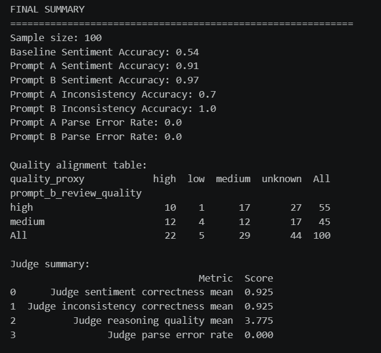

# Design and Evaluation of an LLM-Based Review Reliability System

## Executive Summary
This project designs and evaluates an LLM-based system to assess the reliability of online product reviews in an e-commerce context, with a focus on mismatches between star ratings and review text.

The dataset contains over 500,000 Amazon reviews. Due to computational constraints and API cost limitations, it is first reduced to 10,000 observations, followed by a balanced sample of 100 reviews for LLM-based evaluation.

Results show that the system can effectively detect sentiment and inconsistencies, but also reveal a key issue: rating systems themselves are not always reliable indicators of true customer opinion.

---

## Business Context
- Online reviews are widely used to:
  - evaluate products  
  - guide purchasing decisions  
  - support business analytics  

- This assumes:
  - ratings accurately reflect customer sentiment  

- In practice:
  - ratings and text often do not align  
  - reviews can be vague or misleading  

-> If ratings are unreliable, decisions based on them are also unreliable  

---

## Approach
- Dataset: Amazon product reviews (>500k rows)  
- Reduced to 10,000 observations, then sampled to 100 reviews due to computational and API constraints  

- Methods:
  - rule-based sentiment baseline  
  - LLM-based pipeline for:
    - sentiment classification  
    - inconsistency detection  
    - review quality assessment  

- Evaluation:
  - comparison with rating-derived sentiment  
  - derived inconsistency labels  
  - LLM-as-judge assessment  

---

## Results

- LLM outperforms baseline:
  - sentiment accuracy: 0.54 -> 0.97  
  - inconsistency detection: up to 1.00  

- However, some issues including:
  - small sample size (100)  
  - proxy labels derived from model logic  
  - prompt design strongly guides outputs  

-> High accuracy reflects consistency within the setup, not necessarily real-world performance  

---

## Key Insights
- Ratings are not reliable indicators of sentiment  
  -> many 3-star reviews contain negative language  

- Inconsistencies between rating and text are common  
  -> can distort rankings and recommendations  

- Review quality is difficult to measure  
  -> helpfulness votes are sparse and inconsistent  

---

## Business Implications
- Relying only on ratings can lead to:
  - misinterpretation of customer satisfaction  
  - misleading business insights  

- Text analysis provides deeper understanding:
  - ratings show what users select  
  - text reflects actual sentiment  

-> Combining both improves decision-making  

---

## Recommendations
- Combine rating data with text-based sentiment analysis  
- Flag inconsistent reviews  
- Improve review systems to encourage informative feedback  
- Use LLMs to monitor review reliability at scale  

---

## Limitations
- Small evaluation sample due to computational and API cost constraints  
- Use of proxy labels introduces noise  
- Partial circularity in inconsistency evaluation  
- LLM-as-judge may introduce bias  

-> Results should be interpreted with caution  

---

## Skills Demonstrated
- LLM application in business problems  
- Prompt engineering and evaluation design  
- Analytical thinking and business interpretation  
